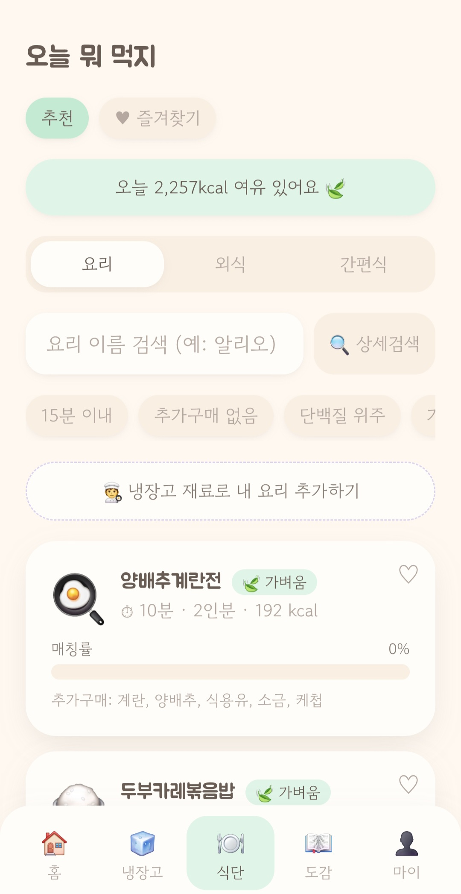
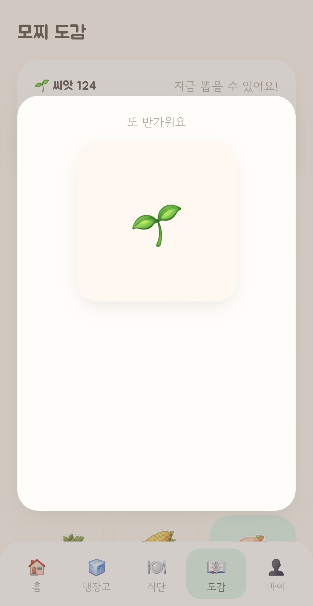
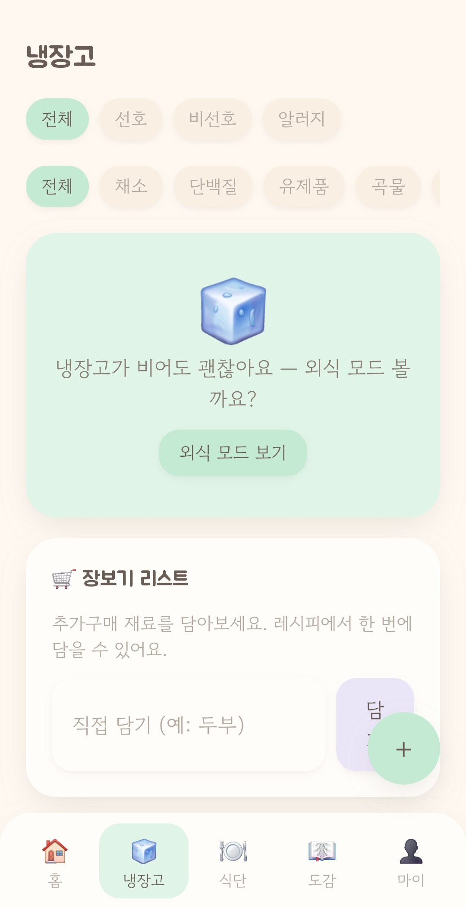
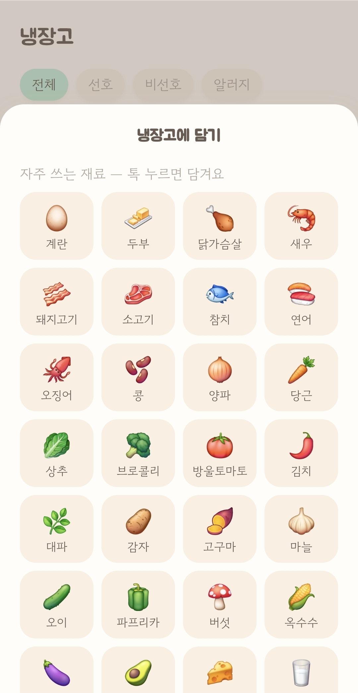
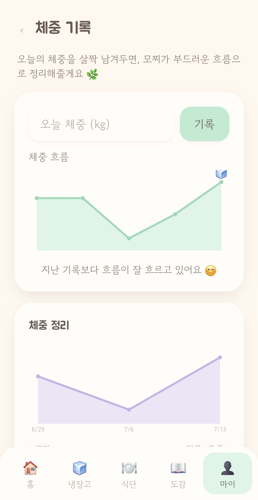

# 🧊 모찌(Mochi)

> "오늘 뭐 먹지"를 모찌가 대신 풀어주는, **죄책감 없는 사전 제안형 식사 컴패니언**.
> 다이어트를 *관리(tracking)* 가 아니라 *수집(collecting)* 의 즐거움으로 바꾼다.

핵심 루프는 **제안 → 기록 → 수집**. 진행도는 숫자가 아니라 마스코트 '모찌'의 성장으로 표현한다.


**🔗 [웹에서 바로 써보기](https://mochi-nu-ashen.vercel.app)** · Android 앱은 Google Play 내부 테스트 진행 중

| 홈 — 제안 | 식단 — 고르기 | 도감 — 수집 |
|:---:|:---:|:---:|
|  |  |  |
| 숫자 대신 모찌의 성장 단계로 진행도를 보여준다 | 냉장고 재료와의 매칭률·추가구매 목록을 함께 제시 | 건강 행동으로만 모이는 '씨앗'으로 카드를 뽑는다 |

| 냉장고 — 재료 | 담기 — 한 번에 | 마이 — 체중 흐름 |
|:---:|:---:|:---:|
|  |  |  |
| 비어 있어도 막다른 화면이 되지 않게 외식 모드로 안내 | 자주 쓰는 재료는 탭 한 번으로 (낙관적 업데이트) | 기록량에 따라 주간→월별→연간이 단계적으로 열린다 |

---

## 한눈에

| | |
|---|---|
| **역할** | 1인 개발 — 기획 · 디자인 · 프론트엔드 · 백엔드 · 배포 전 범위 |
| **기간** | 2026.06 ~ 2026.09 (약 2개월) · 커밋 204 · PR 61건 |
| **규모** | TypeScript 15,700줄 · API 라우트 45개 · DB 23모델 · 테스트 37파일 213케이스 |
| **배포** | Vercel(웹) / Google Play 내부 테스트(Android — Capacitor 원격 URL 셸) |

---

## 무엇을 해결했나

다이어트 앱의 이탈 원인이 **기능 부족이 아니라 죄책감**이라고 봤다. 대부분의 앱은 이미 먹은 것을 사후에 계산해 부족분을 지적한다. 모찌는 순서를 뒤집어 **먹기 전에 먼저 제안**하고, 기록은 그 제안을 따랐다는 확인으로만 쓴다. 그리고 진행도를 체중·달성률이 아니라 **마스코트의 성장과 카드 수집**으로 치환했다 — 숫자는 끊기면 낮아지지만 수집은 되돌아가지 않기 때문이다.

이 판단은 코드에도 규칙으로 박아뒀다. 아래 [제품 원칙](#제품-원칙-코드가-지키는-불변-규칙) 5가지가 그것이고, 그중 색상 규칙은 lint로 강제한다.

---

## 기술적으로 어려웠던 것 3가지

### 1. 알림이 앱 이름이 아니라 브라우저 이름으로 떴다

**문제** — PWA를 TWA로 감싸 배포했는데, 삼성 인터넷 사용자에게는 푸시 알림이 "모찌"가 아니라 **브라우저 명의로** 표시됐다. 국내 안드로이드 사용자 상당수가 기본 브라우저로 쓰는 환경이라 무시할 수 없었다.

**원인** — TWA의 알림 위임은 Chrome 전용이고 Digital Asset Links 검증에 의존한다. 삼성 인터넷은 이 경로를 지원하지 않아, 웹푸시가 브라우저 앱 자신의 알림으로 처리된다. 웹 표준만으로는 해결할 수 없는 구조적 한계였다.

**판단** — 앱 셸을 **Capacitor로 교체하고 FCM 네이티브 푸시를 추가**했다. 원격 URL 모드를 유지해 "웹 배포 = 앱 반영"이라는 기존 장점은 그대로 두고, 셸은 푸시·뒤로가기·외부링크만 담당하게 했다(웹 번들은 Capacitor를 모른다). 손대기 전에 **되돌릴 수 없는 제약 두 가지를 먼저 확정**했다.

- **패키지명과 서명키를 유지해야 한다** — 바뀌면 Play가 업데이트가 아닌 신규 앱으로 받아, 진행 중인 테스터·심사가 전부 끊긴다.
- **Capacitor 7이 아니라 8이어야 한다** — 16KB 페이지 정렬 미준수 앱은 Play가 제출 자체를 거부한다.

**결과** — 알림이 앱 명의로 표시되고, 웹 배포 파이프라인은 그대로 유지됐다. 웹푸시는 브라우저 사용자용으로 병행한다.

푸시는 두 경로 모두 **새 의존성 없이** 구현했다. 웹푸시는 VAPID(RFC 8292) ES256 서명을 `node:crypto`로 직접 만들었고(JWT 서명은 DER이 아니라 `ieee-p1363` r‖s여야 한다), 페이로드를 실으려면 RFC 8291 암호화가 필요해 **의도적으로 페이로드 없는 푸시**를 택했다 — 리마인더는 문구가 정해져 있어 실을 것이 없고, 문구는 기기의 서비스 워커가 시각을 보고 정한다. FCM은 HTTP v1을 서비스계정 JWT로 직접 호출하고 토큰을 1시간 캐시한다. 두 모듈은 `"gone"(404/410) → 호출한 쪽이 DB에서 구독을 지운다`는 같은 계약을 공유한다.

> `src/server/push/webpush.ts` · `src/server/push/fcm.ts` · `native/README.md`

### 2. 배포된 칼로리가 800배 틀려 있었다

**문제** — 양배추된장국이 **2,061kcal**로 표시됐다. 이 값은 화면 표시로 끝나지 않고 사용자의 예산·기록 계산에도 들어가고 있었다.

**원인** — 레시피 원본에 영양 정보가 없어 재료 문자열에서 그램수를 추정했는데, 그 로직이 **테스트 없는 인제스트 스크립트 안에 인라인**으로 있었다. `'마리'`를 전부 800g(닭·생선 기준)으로 처리해 국물용 멸치 10마리가 8kg이 된 게 진원지였고, 함께 나온 것들이 이렇다.

- 단위를 토큰의 **아무 위치에서나** 매칭 — 이름에 우연히 들어간 글자가 단위로 오인됐다
- `배추`가 `양배추`에 부분일치
- **작은술·숟갈 패턴이 아예 없어** 기본값 50g으로 샜다
- 분수 수량(`½`)을 `parseFloat`가 1로 읽었다

**판단** — 순수 모듈로 분리하고 실제 원본 문자열로 테스트 13개를 고정했다. 다만 개별 버그를 다 잡아도 다음 오차는 또 나온다고 봤다. 그래서 근본 대비로 **상한(`plausibleKcal`, 1인분 1,500kcal)을 두고 넘으면 값을 아예 싣지 않게** 했다. 근거는 이 숫자가 예산과 기록으로 흘러들어간다는 것 — **틀린 값은 없는 것보다 나쁘다.**

**결과** — 1,500kcal 초과 항목 17개 → **0개**, 평균 266kcal. 원본이 정확했던 다른 데이터 출처는 같은 기준으로 검토한 뒤 건드리지 않기로 했다.

> `src/features/recommend/kcalEstimate.ts` · `kcalEstimate.test.ts`

### 3. 로그인은 되는데 모든 화면이 비어 있었다


**문제** — 한동안 앱을 열지 않다가 들어오면 **화면은 정상적으로 열리는데 모든 데이터가 비어 있는** 상태가 됐다. 로그인 화면으로 튕기지도 않아서, 사용자는 텅 빈 앱에 갇혔고 빠져나올 길이 마이 탭의 로그아웃 버튼뿐이었다.

**원인** — 미들웨어가 세션 쿠키의 **존재만** 검사하고 있었다(`request.cookies.has(...)`). 쿠키는 남았는데 서버 세션이 만료·폐기되면 라우터 가드는 통과하고 조회만 전부 401이 된다. 게다가 미들웨어 matcher에 **`/api/*`가 들어 있지 않아서**, API 401은 어떤 가드에도 걸리지 않고 그대로 화면에 도달했다. 코드에는 "401 일괄 처리"라는 주석만 있고 구현이 없었다.

**판단** — 라우터 가드를 강화하는 대신 **응답 쪽에서 복구**하기로 했다. 미들웨어의 쿠키 검사는 어디까지나 1차 방어이고 진짜 검증은 각 Route Handler가 하는 다층 방어 구조를 유지하고 싶었기 때문이다. TanStack Query의 `QueryCache`/`MutationCache` `onError`에 401 복구를 붙이고, 그 과정에서 세 가지를 따로 처리했다.

- **되돌이 이동 방지** — `/login`에서 난 401 때문에 다시 `/login`으로 보내면 무한 루프가 된다. 공개 경로 판별을 `isPublicPath()` **순수 함수로 분리해 테스트**했다. 메일 링크로 들어오는 `/reset-password`·`/verify-email`도 비로그인으로 열려야 하고, 판별은 세그먼트 경계를 지켜야 한다(`/loginx`가 걸리면 안 된다). 이동 루프는 눈으로 잡기 어려운 종류의 버그라 테스트로 고정했다.
- **동시 401 중복 실행 방지** — 화면 하나가 여러 쿼리를 동시에 던지므로 401도 동시에 온다. `recovering` 플래그로 복구를 한 번만 실행하고, 서버와 다시 통하면(`onSuccess`) 플래그를 풀어 **다음 만료 때도 똑같이 동작**하게 했다.
- **4xx 재시도 차단** — 401·403·404·검증 오류는 다시 물어봐도 답이 같다. 재시도를 없애 복구가 지연되지 않게 했다.

같은 맥락에서 **성능을 위해 껐던 `refetchOnReconnect`를 의도적으로 다시 켰다.** 지하철·엘리베이터에서 끊긴 화면이 계속 비어 있는 게, 재연결 시 stale된 것만 다시 부르는 비용보다 나쁘다고 판단했다.

**결과** — 세션이 끝나면 남은 쿠키를 정리하고 로그인 화면으로 부드럽게 되돌린다. 스크린샷의 '로그인 유지' 체크는 이 작업과 함께 들어간 것으로, 체크하면 7일 지속 쿠키를, 해제하면 세션 쿠키를 쓰고 30분 이상 자리를 비우면 재로그인을 요구한다.

> `src/middleware.ts` · `src/app/providers.tsx` · `src/features/auth/publicPaths.ts`

---

## 스택

- **프레임워크**: Next.js 15 (App Router) + TypeScript — 풀스택 단일 레포
- **스타일**: Tailwind CSS (파스텔 디자인 토큰)
- **서버 상태 / 전역 상태**: TanStack Query / Zustand
- **애니메이션**: Framer Motion + Lottie
- **DB / ORM**: PostgreSQL + Prisma
- **검증**: Zod · **테스트**: Vitest + Testing Library
- **배포**: Vercel + Supabase(또는 Neon) · Android 셸은 Capacitor 8

외부 연동은 **SDK 대신 REST + `node:crypto`** 로 통일했다 — 메일(Brevo) · 레이트리밋(Upstash) · 사진(Supabase Storage) · 웹푸시(VAPID) · 네이티브 푸시(FCM). 번들과 콜드스타트를 무겁게 하지 않으면서 실패 지점을 직접 다 보기 위한 선택이다.

## 시작하기

```bash
# 1. 의존성 설치
npm install

# 2. 환경변수 — 예시를 복사해 값 채우기 (.env.local 은 깃에 올라가지 않음)
cp .env.example .env.local

# 3. Prisma 클라이언트 생성 (스키마 변경 시 재실행)
npx prisma generate
# DB 연결 후 마이그레이션:  npx prisma migrate dev

# 4. 개발 서버
npm run dev   # http://localhost:3000
```

요구사항: Node 20+ · PostgreSQL(로컬 또는 Supabase/Neon).

## 스크립트

| 명령 | 설명 |
|---|---|
| `npm run dev` | 개발 서버 |
| `npm run build` / `npm run start` | 프로덕션 빌드 / 실행 |
| `npm run lint` | ESLint (디자인 토큰 위반·임의 hex 색상 차단 포함) |
| `npm run typecheck` | `tsc --noEmit` |
| `npm run test` | Vitest |

## 프로젝트 구조

```
src/
├── app/            # App Router — 페이지·레이아웃·Route Handler(얇게)
│   ├── (main)/     #   홈·냉장고·식단·도감·마이 (하단 5탭)
│   ├── (auth)/     #   로그인·온보딩
│   └── api/        #   Route Handlers: Zod 검증 → 서비스 → ApiResponse
├── features/       # 도메인 클라 로직 (api · hooks · components · types)
├── server/         # 서버 전용: services(비즈니스·Prisma) · auth · db · push · email · storage
├── components/ui/  # 디자인 시스템 (Button, Card, MochiAvatar …)
├── lib/            # ApiResponse · fetcher · messages(모찌 보이스) · utils
├── store/          # Zustand
└── types/          # 공용 타입 (ApiResponse, MochiState)
native/             # Capacitor 안드로이드 셸 (웹과 의존성 분리)
```

도메인: `auth` · `fridge` · `recommend` · `record` · `collection` · `mochi`.
계층 의존 방향은 `app → features → server/services → db`. 도메인 간엔 ID/공개 타입으로만 참조한다.

**테스트 전략** — 순수 도메인 로직(추천 랭킹·칼로리 추정·스트릭·가챠 확률·경로 판별 등)을 부수효과 없는 모듈로 떼어내 그쪽에 테스트를 몰아둔다. 37개 파일 213케이스가 전부 여기에 있고, IO 껍데기는 테스트하지 않는다.

## 제품 원칙 (코드가 지키는 불변 규칙)

1. **죄책감 제로** — 빨강 경고색·실패 메시지·강압적 숫자 타겟 금지. 카피도 부드러운 '모찌 보이스'.
2. **홈에 숫자 금지** — 체중·칼로리·달성률은 마이(`me`) 탭으로 격리.
3. **모찌 상태 고정** — `'happy' | 'sleepy' | 'idle' | 'cheer'` 유니온만.
4. **디자인 토큰만** — 색·라운드·그림자는 `tailwind.config.ts` 토큰만 (임의 hex 금지, lint로 강제).
5. **비요리 사용자 동등** — 외식·간편식 모드도 동일한 제안→기록→수집 루프.

## 브랜치 전략

`dev` 작업 → PR → `main` 머지. `main` 직접 push 금지(Branch Protection).

## 데이터 출처

레시피 데이터는 [만개의레시피](https://www.10000recipe.com/) 공개 덤프(KADX, 제공: 한국농수산식품유통공사)와 식품의약품안전처 조리식품 레시피 DB를 사용한다. 만개 데이터는 **비영리 이용 조건(CC-NC)** 을 지켜 조리 단계·사진·소개글을 저장하지 않고 원문 링크로 연결하며, 저장하는 것은 요리명·재료명·조리시간·인분뿐이다. 표시되는 kcal은 원본 값이 아니라 위 2번에서 만든 자체 추정치다.
